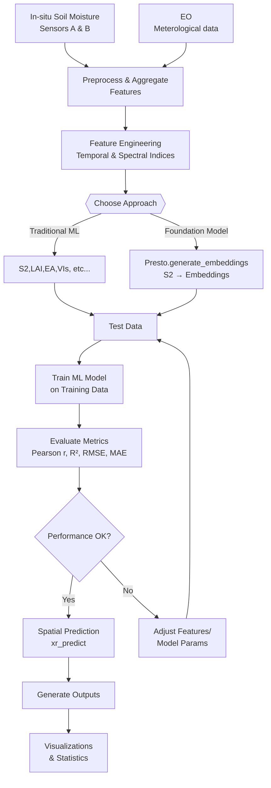

# dhi-mleo

**dhi-mleo** is a Python library designed to integrate in-situ measurements and Earth Observation data with machine learning workflows. It offers:

* Spatial prediction and inference with Xarray.
* Robust spatial and temporal cross-validation strategies.
* Efficient handling of time series data.
* A flexible workflow compatible with any machine learning model or task.

## Installation 

Quick install from GitHub:

```bash
pip install "dhi-mleo @ git+https://github.com/ScaleAGData/dhi-mleo.git"
# or
uv pip install "dhi-mleo @ git+https://github.com/ScaleAGData/dhi-mleo.git"
```

**Optional Extras**
You can also install feature-specific extras:

* `ml_exta` – extra machine learning libraries
* `viz` – extra visualization libraries
* `geo` – geospatial libraries
* `dev` – developer tools (tests, linters, docs)
* `notebooks` – Jupyter support

---

For sxample
```bash
pip install "dhi-mleo[ml_extra,viz,geo,notebooks] @ git+https://github.com/ScaleAGData/dhi-mleo.git"
# or
uv pip install "dhi-mleo[ml_extra,viz,geo,notebooks] @ git+https://github.com/ScaleAGData/dhi-mleo.git"
```

## Workflow

