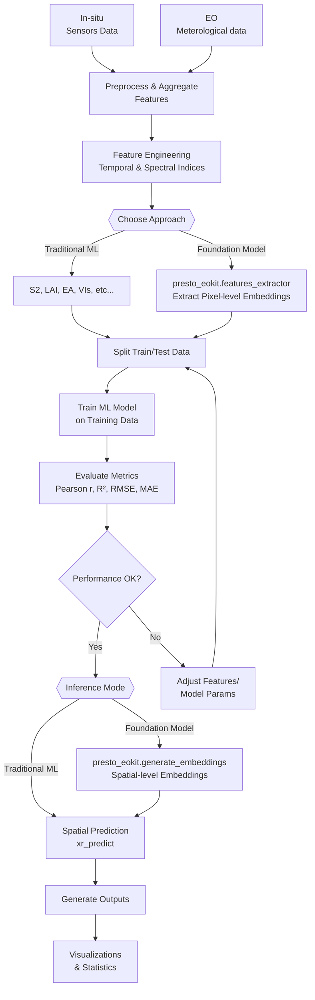
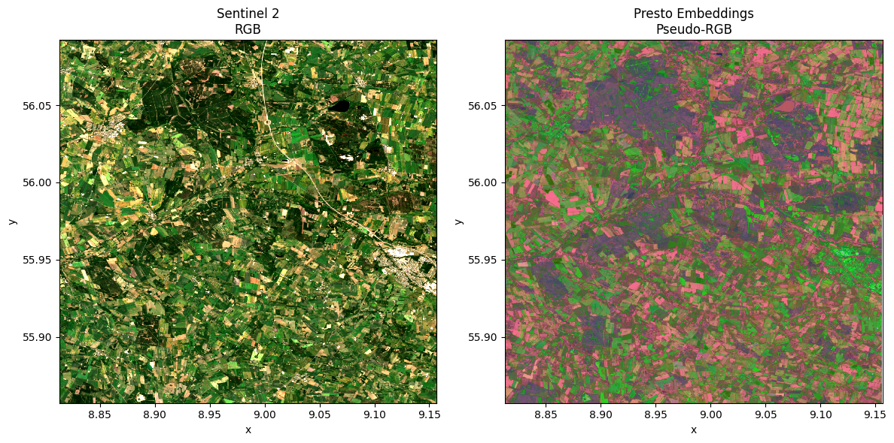
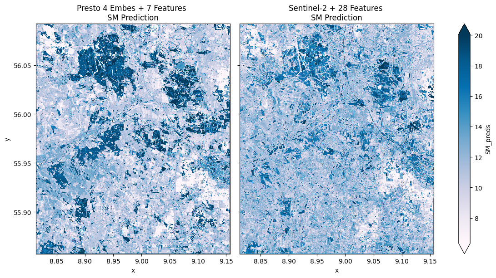

# dhi-mleo

**dhi-mleo** is a Python library designed to integrate in-situ measurements and Earth Observation data with machine learning workflows. It offers:

* Spatial prediction and inference with Xarray.
* Robust spatial and temporal cross-validation strategies.
* Efficient handling of time series data.
* A flexible workflow compatible with any machine learning model or task.

## Motivation
In-situ and satellite data often complement each other: the former provides highly accurate measurements but only at local scale and with limited temporal extent, while the latter provides spatial and temporal estimates over much larger scales but potentially with lower accuracy. By fusing the two sets of data with the help of advanced machine-learning methods, including foundation models, those synergies can be exploited to obtain robust and accurate local and regional maps. In the ScaleAgData context, the workflows presented in this repository focus on fusion of in-situ and satellite-based soil moisture estimates to be used by Water, Yield and other Research and Innovation Labs. However, those methods should be equally applicable to other biophysical parameters measurable both on the ground and from satellite sensors.   

## Installation 

Quick install from GitHub:

```bash
pip install "dhi-mleo @ git+https://github.com/ScaleAGData/dhi-mleo.git"
# or
uv pip install "dhi-mleo @ git+https://github.com/ScaleAGData/dhi-mleo.git"
```

**Optional Extras**
You can also install feature-specific extras:

* `ml_exta` – extra machine learning libraries
* `viz` – extra visualization libraries
* `geo` – geospatial libraries
* `dev` – developer tools (tests, linters, docs)
* `notebooks` – Jupyter support

---

For sxample
```bash
pip install "dhi-mleo[ml_extra,viz,geo,notebooks] @ git+https://github.com/ScaleAGData/dhi-mleo.git"
# or
uv pip install "dhi-mleo[ml_extra,viz,geo,notebooks] @ git+https://github.com/ScaleAGData/dhi-mleo.git"
```

## Workflow




## Examples

### Presto Foundation Model Embeddings


### Spatial Prediction Comparison
*Comparison of soil moisture predictions: Foundation Model approach (Presto 4-embeddings + Minumal number of Expert features) Vs Traditional ML approach (Sentinel-2 + Expert features).*

